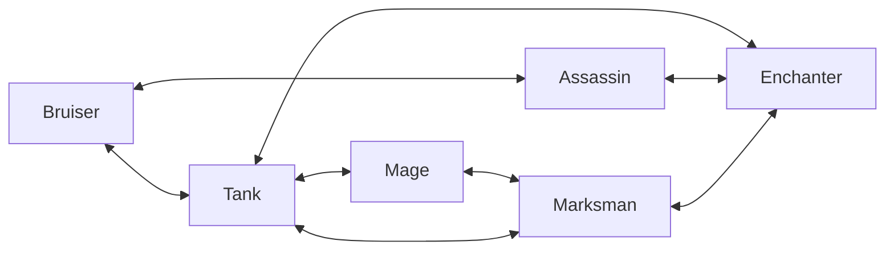
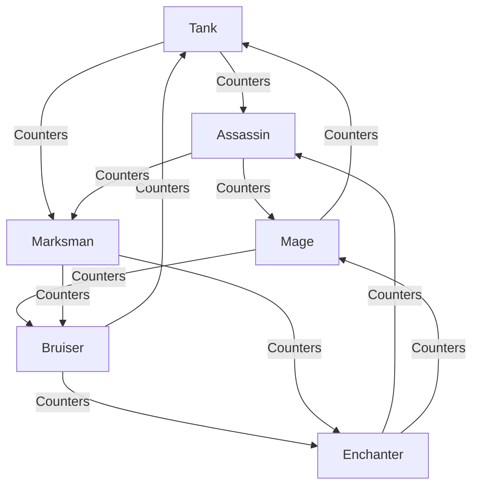

# Hero Archetypes: Synergies and Counters

This document explains the strategic relationships between different hero archetypes in the MemServer match engine. Understanding these interactions is key to drafting a winning team.

## Overview of Archetypes

There are 6 primary archetypes in the game:
*   **Tank**: High durability, focuses on protection and crowd control.
*   **Bruiser**: A mix of durability and damage, good for sustained fights.
*   **Assassin**: High burst damage, excels at taking down squishy targets.
*   **Mage**: Area-of-effect damage and zone control.
*   **Marksman**: High sustained physical damage (DPS).
*   **Enchanter**: Focuses on utility, shields, and buffing allies.

---

## Synergy Map
Synergies provide a **+3.00 point bonus** to the team's performance for each compatible pair.

| Archetype | Synergizes Well With... | Strategy |
| :--- | :--- | :--- |
| **Tank** | Mage, Enchanter | Frontline protection for high-impact backline. |
| **Bruiser** | Assassin, Tank | "Dive buddies" who can jump into the enemy together. |
| **Assassin** | Bruiser, Enchanter | Speed and shields to help the assassin survive the dive. |
| **Mage** | Tank, Marksman | CC support for DPS and frontline to keep enemies at bay. |
| **Marksman** | Enchanter, Tank | Maximum protection for the primary damage dealer. |
| **Enchanter** | Marksman, Assassin | Buffing the main carry or enabling a lethal dive. |

### Synergy Diagram (Mermaid)

---

## Counter Map
Counters provide a **+5.00 point bonus** to the team's performance for each hero that counters an opponent's hero.

| Archetype | Counters... | Reason |
| :--- | :--- | :--- |
| **Tank** | Assassin, Marksman | Hard to kill for sustained/burst damage. |
| **Bruiser** | Tank, Enchanter | Can shred through tanks and punish squishy utility. |
| **Assassin** | Mage, Marksman | High burst damage deletes squishy backliners. |
| **Mage** | Bruiser, Tank | Zone control and CC prevents them from engaging. |
| **Marksman** | Bruiser, Enchanter | High sustained DPS can melt bruisers and out-scale utility. |
| **Enchanter** | Assassin, Mage | Shields and peel negate burst damage. |

### Counter Diagram (Mermaid)

---

## Summary Table

| Archetype | Synergies | Counters | Countered By |
| :--- | :--- | :--- | :--- |
| **Tank** | Mage, Enchanter | Assassin, Marksman | Bruiser, Mage |
| **Bruiser** | Assassin, Tank | Tank, Enchanter | Mage, Marksman |
| **Assassin** | Bruiser, Enchanter | Mage, Marksman | Tank, Enchanter |
| **Mage** | Tank, Marksman | Bruiser, Tank | Assassin, Enchanter |
| **Marksman** | Enchanter, Tank | Bruiser, Enchanter | Tank, Assassin |
| **Enchanter** | Marksman, Assassin | Assassin, Mage | Bruiser, Marksman |
